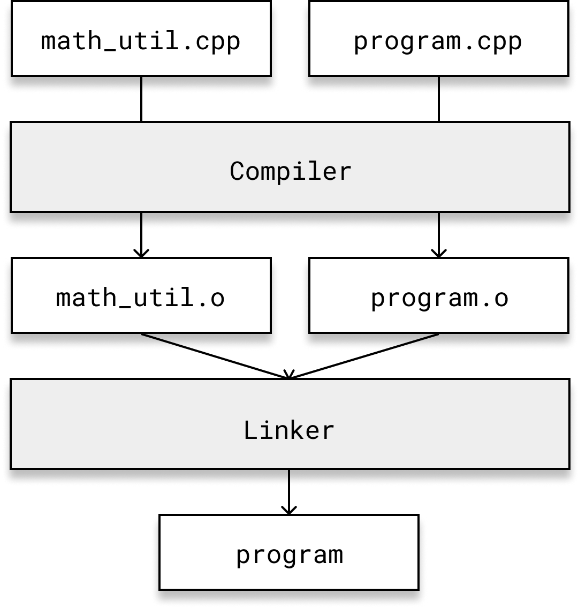
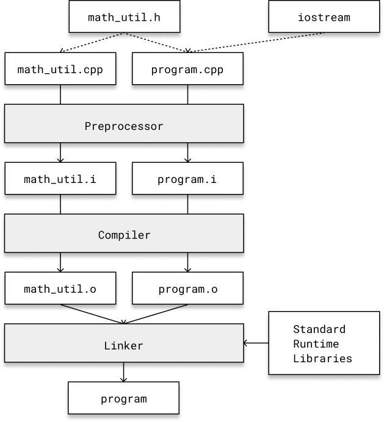

# Header Files

Consider the following program:

**program.cpp**
```cpp
#include <iostream>

constexpr double pi { 3.14159265 };

double radiansToDegrees(double radians) {
    return radians * (180.0 / pi);
}

double degreesToRadians(double degrees) {
    return degrees * (pi / 180.0);
}

int main() {
    double degrees { 30 };
    std::cout << degrees << " degrees in radians: " << degreesToRadians(degrees) << std::endl;

    double radians { 2.54 };
    std::cout << radians << " radians in degrees: " << radiansToDegrees(radians) << std::endl;
}
```

Some time later you begin working on another program, and you would like to make use of these functions that you defined in this first program. In fact, you can see yourself reusing these functions in lots of different programs!

How should we proceed?

---

It's time to break our file up.

The first thing we should do is separate the code we intend to share from `program.cpp` and place it into another source file appropriately named `math_utilities.cpp`:

**math_utilities.cpp**
```cpp
constexpr double pi { 3.14159265 };

double radiansToDegrees(double radians) {
    return radians * (180.0 / pi);
}

double degreesToRadians(double degrees) {
    return degrees * (pi / 180.0);
}
```

**program.cpp**
```cpp
#include <iostream>

int main() {
    double degrees { 30 };
    std::cout << degrees << " degrees in radians: " << degreesToRadians(degrees) << std::endl;

    double radians { 2.54 };
    std::cout << radians << " radians in degrees: " << radiansToDegrees(radians) << std::endl;
}
```

What happens when we then run:

```bash
g++ -o program math_utilities.cpp program.cpp
```

---

We get compiler errors:

```cpp
program.cpp:5:56: error: use of undeclared identifier
      'degreesToRadians'
    std::cout << degrees << " degrees in radians: " << degreesToRadians(d...
                                                       ^
program.cpp:8:56: error: use of undeclared identifier
      'radiansToDegrees'
    std::cout << radians << " radians in degrees: " << radiansToDegrees(r...
                                                       ^
2 errors generated.
```

The compiler cannot resolve these functions within `program.cpp`, as each source file is compiled completely independently from others, and `program.cpp` does not contain any declarations or definitions of functions with these names.

We can forward declare them to resolve this issue:

**program.cpp**
```cpp
#include <iostream>

double radiansToDegrees(double radians);
double degreesToRadians(double degrees);

int main() {
    double degrees { 30 };
    std::cout << degrees << " degrees in radians: " << degreesToRadians(degrees) << std::endl;

    double radians { 2.54 };
    std::cout << radians << " radians in degrees: " << radiansToDegrees(radians) << std::endl;
}
```

Now what happens when we run:

```bash
g++ -o program math_utilities.cpp program.cpp
```

---

It compiles, and it links successfully!



We now have our math functions in `math_utilities.cpp`, and if we forward declare all the functions we want to use in our program and compile our program with `math_utilities.cpp`, we can achieve our goal of writing code once and using it in multiple places.

But having to forward declare every function that is defined in another file would be extremely laborious. There is a better way. Header files.

Let's create an accompanying `math_utilities.h` header file for `math_utilities.cpp` that contains these function declarations:

**math_utilities.h**
```cpp
double radiansToDegrees(double radians);
double degreesToRadians(double degrees);
```

Now we can simply `#include` this header file where we want to use these functions:

**program.cpp**
```cpp
#include "math_utilities.h"
#include <iostream>

int main() {
    double degrees { 30 };
    std::cout << degrees << " degrees in radians: " << degreesToRadians(degrees) << std::endl;

    double radians { 2.54 };
    std::cout << radians << " radians in degrees: " << radiansToDegrees(radians) << std::endl;
}
```

Notice how we use `""` to include headers from our own project, and `<>` to include headers external to our project and headers from the standard library. Here we `#include` the iostream header, which contains, among other things, the information necessary for the compiler to understand `std::cout` and `std::endl`.

The source should also always `#include` its corresponding header file:

**math_utilities.cpp**
```cpp
#include "math_utilities.h"

constexpr double pi { 3.14159265 };

double radiansToDegrees(double radians) {
    return radians * (180.0 / pi);
}

double degreesToRadians(double degrees) {
    return degrees * (pi / 180.0);
}
```

The preprocessor will just replace `#include "math_utilities.h"` with the contents of `math_utilities.h`. The result is exactly as if we wrote forward declarations of the functions at the top of our source file, except the preprocessor does it all for us.



## Include Guards
Including the same header file multiple times, either directly in the same file or transitively through including another header file which includes that header file, could cause redefinition errors. To prevent this we use include guards. They are preprocessor directives that wrap the entire header file, telling the preprocessor to skip it if it has already processed it for the current translation unit. Here's an example:

**math_utilities.h**
```cpp
#ifndef MATH_UTILITIES_H
#define MATH_UTILITIES_H

double radiansToDegrees(double radians);
double degreesToRadians(double degrees);

#endif // MATH_UTILITIES_H
```

Alternatively, you can use the `#pragma once` directive, which is identical and supported by most modern compilers:

```cpp
#pragma once

double radiansToDegrees(double radians);
double degreesToRadians(double degrees);
```

Whichever type of include guards you decide to use, be consistent, and always use them.

# Exercises

## Exercise 1
In a C++ header file, we generally write ________________ (declarations/definitions) of functions, classes, and global variables.

---

```
declarations
```

## Exercise 2
The preprocessor directive ____________ is used to include a header file in a C++ program.

---

```
#include
```

## Exercise 3
Which of the following statements are true about header files in C++? (Select all that apply)

```
a. Header files often end with the .h or .hpp extension.
b. Header files contain the main function of a program.
c. Header files can contain function declarations.
d. Header files are preprocessed before the compilation of the program.
```

---

```
a, c, d
```

## Exercise 4
Run the following compiler command on our previous source file:

```
g++ -E -o math_utilities.i math_utilities.cpp
```

What is the output? What does the `-E` compiler option do?

---

The output should be something like:
```
# 1 "math_utilities.cpp"
# 1 "<built-in>" 1
# 1 "<built-in>" 3
# 414 "<built-in>" 3
# 1 "<command line>" 1
# 1 "<built-in>" 2
# 1 "math_utilities.cpp" 2
# 1 "./math_utilities.h" 1
double radiansToDegrees(double radians);
double degreesToRadians(float degrees);
# 2 "math_utilities.cpp" 2

constexpr double pi { 3.14159265 };

double radiansToDegrees(double radians) {
    return radians * (180.0 / pi);
}

double degreesToRadians(double degrees) {
    return degrees * (pi / 180.0);
}
```

The -E compiler option just runs the preprocessor. This allows us to see the effect of the `#include` on the file before it gets passed to the compiler.

## Exercise 5
Write a C++ program with a header file `math_functions.h` which declares two functions, `add` and `subtract`. These functions should take two integers as parameters and return an integer. The definitions of these functions should be in a separate source file `math_functions.cpp`. Your main program should include `math_functions.h`, take two integers from the user, and print the sum and difference of the numbers using `add` and `subtract` respectively.

---

**math_functions.h**
```cpp
#pragma once

int add(int a, int b);
int subtract(int a, int b);
```

**math_functions.cpp**
```cpp
#include "math_functions.h"

int add(int a, int b) {
    return a + b;
}

int subtract(int a, int b) {
    return a - b;
}
```

**main.cpp**
```cpp
#include "math_functions.h"
#include <iostream>

int main() {
    int num1, num2;

    std::cout << "Enter two integers: ";
    std::cin >> num1 >> num2;

    std::cout << "Sum: " << add(num1, num2) << "\n";
    std::cout << "Difference: " << subtract(num1, num2) << "\n";

    return 0;
}
```