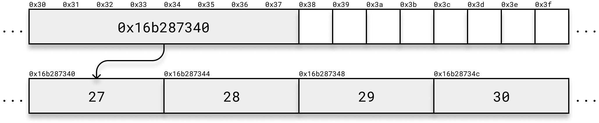
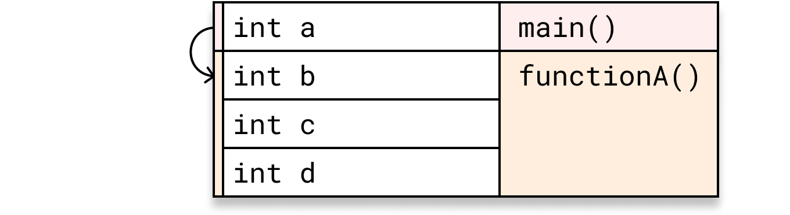
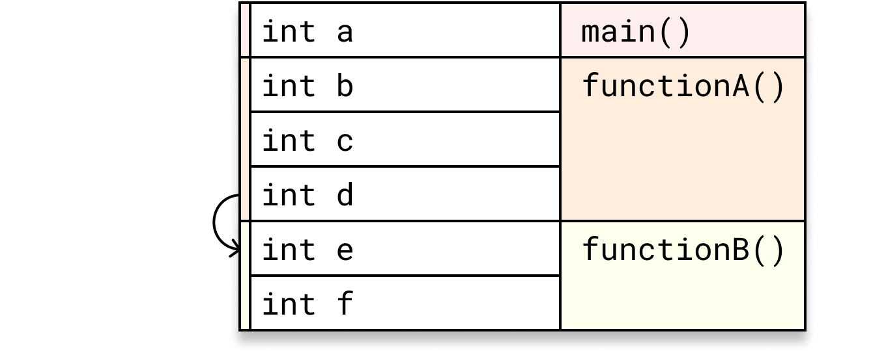
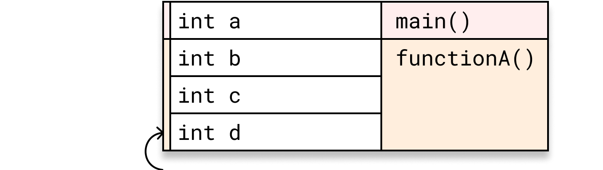
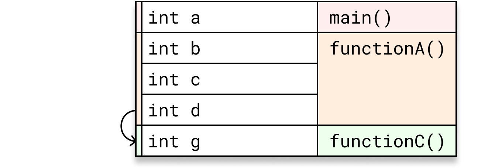
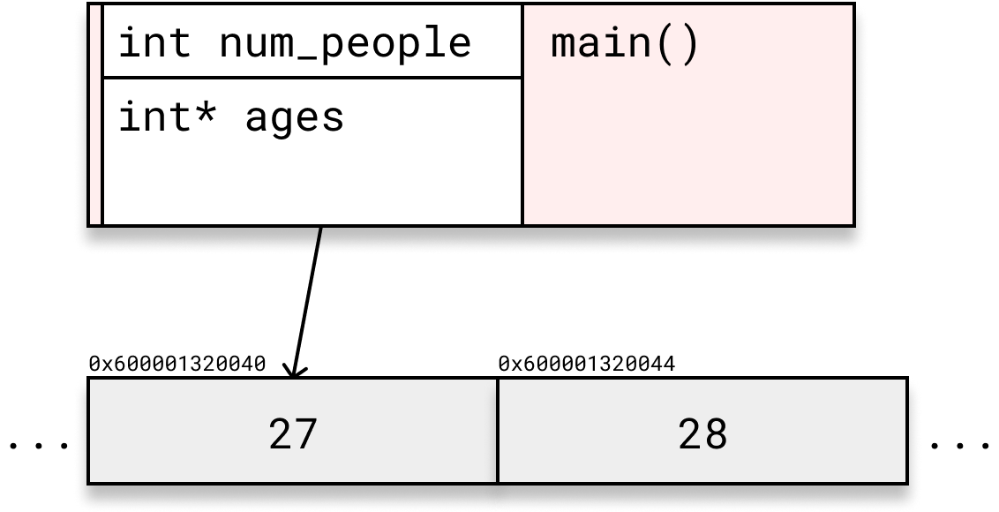
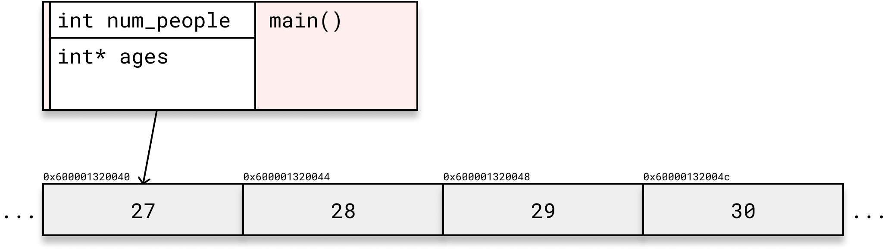
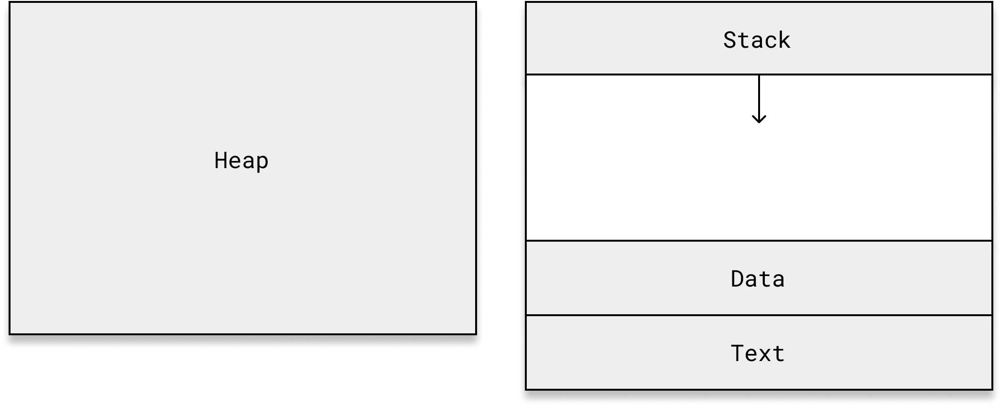

# Memory

## Organization

Computer memory is organized as a sequence of bytes. Each byte in memory has a unique address.

You can visualize memory as a series of boxes, with each box representing a byte and its address:


Here we see 16 bytes beginning from address 0x30, which is 48 in hexadecimal.

The fundamental data types, such as `bool`, `char`, `int`, `float`, and `double` take up a fixed space in memory that determines the range of values that can be stored in it. But how much space?

A `char` variable requires enough memory to hold a single character, typically an 8-bit byte:


A `bool`, despite representing one of two values, which could fit into a single bit, also takes up a byte:


The size of larger types is compiler implementation-defined. In other words, it may be different on different machines and with different compilers.

An `int` typically takes up 4 bytes:


A `float` typically takes up 4 bytes:


A `double` typically takes up 8 bytes:


A pointer, which is just an address where another variable is stored, takes up 8 bytes (64 bits) on a 64-bit machine:


Take the following code, which defines an array of integers called ages:
```cpp
int ages[] = { 27, 28, 29, 30 };
```
The contents of `ages` is stored contiguously in memory:


If we dynamically allocate the same array of integers:

```cpp
int* ages = new int[]{ 27, 28, 29, 30 };
```

we have a pointer to an array of integers:



## Using the `sizeof` Operator

To determine the size of a data type in your specific environment, you can use the `sizeof` operator. The `sizeof` operator returns the size (in bytes) of the specified data type or object.

```cpp
#include <iostream>

int main() {
    std::cout << "Size of int: " << sizeof(int) << " bytes" << std::endl;
    std::cout << "Size of float: " << sizeof(float) << " bytes" << std::endl;
    std::cout << "Size of double: " << sizeof(double) << " bytes" << std::endl;
    std::cout << "Size of char: " << sizeof(char) << " byte" << std::endl;
    
    return 0;
}
```

It is also possible to use the `sizeof` operator on variables.

What would you expect the output of the following code to be:

```cpp
int* ages = new int[]{ 27, 28, 29, 30 };
std::cout << sizeof(ages) << std::endl;
```

---

```
8
```

# Stack and Heap Memory

In the previous code examples, we create an array of integers in two different ways. We can see from the view of the underlying bytes exactly how these two are different. In the first example, we just have the four integers allocated contiguously in memory. In the second example, we have the same four integers allocated contiguously in memory and also a pointer to the address where those four integers are stored. What is going on here? Why is there a difference?

## Stack Memory

In the first example, we are using **stack memory**. Stack memory is allocated automatically for local variables and function calls by the program, and the memory needed for this is determined at compile time, before the program even runs. Stack memory operates in a Last-In-First-Out (LIFO) manner, meaning that the most recently allocated memory is the first to be deallocated.

What does this look like?

Let's take the following code as an example:

```cpp
void functionA();
void functionB();
void functionC();

int main() {
    int a = 1;
    functionA();
    return 0;
}

void functionA() {
    int b = 2;
    int c = 3;
    functionB();
    int d = 4;
    functionC();
}

void functionB() {
    int e = 5;
    int f = 6;
}

void functionC() {
    int g = 7;
}
```

When we execute our program and `main()` is called, space for the local variable `a` is allocated on the stack:

```cpp
int main() {
    int a = 1;
    functionA();
    return 0;
}
```


When `functionA()` is called from within `main()`, a new *stack frame* is allocated immediately below the preceding stack frame. This stack frame has space allocated for the local variables `b`, `c`, and `d`.

```cpp
void functionA() {
    int b = 2;
    int c = 3;
    functionB();
    int d = 4;
    functionC();
}
```



Similarly, a new stack frame is allocated below the preceding stack frame when `functionB()` is called from within `functionA()`:

```cpp
void functionB() {
    int e = 5;
    int f = 6;
}
```



When we return from `functionB()`, the memory allocated for variables in `functionB()`'s stack frame is automatically deallocated:

```cpp
void functionA() {
    ...
    int d = 4;
    functionC();
}
```



When `functionC()` is called, a new stack frame is allocated. Note that this new stack frame for `functionC()` occupies the same memory in the stack as `functionB()`'s stack frame occupied previously:

```cpp
void functionC() {
    int g = 7;
}
```



When we return from both `functionC()` then `functionA()`, memory for these two stack frames is deallocated:


When we reach the end of `main()` the only memory that remains allocated on the stack is the memory needed for the local variables within `main()`.

You can see how stack memory is temporary. A stack frame's memory is only accessible while we are in the scope of the corresponding function.

What if we don't know how much memory our program will need at compile time? Or what if we want to allocate memory for a longer duration, and the lifetime of the memory is not tied to the scope of a function? Or what if the amount of memory we want to allocate is too large? Stack memory is fairly limited, and if we run out, our program will crash.

## Heap Memory
In contrast to stack memory, heap memory is used for dynamic memory allocation, such as when using the `new` operator. You would want or need to use heap memory when:
- the size of the memory needed is unknown or very large, which could lead to stack overflow
- the memory is needed for a longer duration, and the lifetime of the memory is not tied to the scope of a function
- you need to allocate memory dynamically during runtime.

Unlike stack memory, heap memory must be explicitly managed (allocated and deallocated) by the programmer. It is also significantly slower, since a program must make a **system call** to the operating system when dynamically allocating and deallocating memory.

What does this look like?

Let's take the following code as an example:

```cpp
#include <iostream>

int main() {
    int num_people{};
    std::cin >> num_people;
    int* ages = new int[num_people];

    // ...

    delete[] ages;

    return 0;
}
```

In the above example, we dynamically allocate an array of integers on the heap using the `new` operator depending on the number of people we need to record ages for. Some time later we deallocate the memory for this array using the `delete` operator.

If we enter 2 at the terminal prompt, our stack and heap memory for this little program will look like the following:



If we instead enter 4, our stack and heap memory will look like the following:



Notice that the stack frame remains the same size, regardless of how much memory we've dynamically allocated on the heap, since we're just storing a pointer to the allocated memory!

## Program Memory Layout

Where do global or static variables live?



Global variables and static variables live in the Data section. The program code that the CPU executes is stored in the Text section.

# Exercises

## Exercise 1
What is the primary advantage of using dynamic memory allocation?

```
A) It allows you to allocate memory during runtime.
B) It requires less memory than static allocation.
C) It automatically deallocates memory when it's no longer needed.
D) It is faster than static allocation.
```

---

```
A) It allows you to allocate memory during runtime.
```

## Exercise 2
Which of the following are correct about stack memory? (Select all that apply)

```
A) Stack memory is limited in size.
B) It is automatically managed by the program.
C) You must explicitly deallocate stack memory.
D) It is used for local variables and function calls.
E) Stack memory can be allocated during runtime.
```

---

```
A) Stack memory is limited in size.
B) It is automatically managed by the program.
D) It is used for local variables and function calls.
```

## Exercise 3
Complete the following code to allocate a dynamically-sized array of floats on the heap:

```cpp
#include <iostream>

int main() {
    int num_values;
    std::cout << "Enter the number of values: ";
    std::cin >> num_values;

    float* values = ____________;

    // ...

    delete[] values;
    return 0;
}
```

---

```cpp
float* values = new float[num_values];
```

## Exercise 4
What happens when a function calls itself, such as in this following program?

```cpp
long add(int a, int b) {
    long result = a + b;
    return add(result, 1);
}

int main() {
    long result = add(3, 4);
    return 0;
}
```

---

When we call `add()` from main, we allocate a new stack frame on the stack. However, we call `add()` again before leaving `add()`, which allocates another stack frame. This process repeats until we exhaust all of our available stack memory. Eventually the program tries to allocate more memory, and the program crashes. The error will likely be a segmentation fault resulting from stack overflow.

## Exercise 5
Complete the following program that prompts the user to enter a positive integer value between 1 and 100 and stores the user's answer in a variable called `num_values`. If the user enters an invalid input, prompt them again until they enter a valid input. Finally, allocate an array of `num_values` integers on the heap and then deallocate it.

```cpp
#include <iostream>

int getNumValuesFromUser() {
    // TODO
}

int* allocateArray(int size) {
    // TODO
}

deallocateArray() {
    // TODO
}

int main() {
    int num_values = getNumValuesFromUser();
    int* values = allocateArray(num_values);
    deallocateArray(values);

    return 0;
}
```