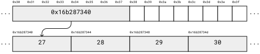
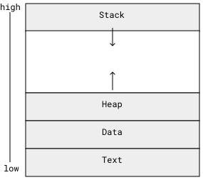

---
- fundamental types mapping to hardware
- sizeof operator
- difference between memory and storage
- heap, stack memory
- function calls
- local variables
- static variables
- constexpr
---

# Memory

## Organization

Computer memory is organized as a sequence of bytes. Each byte in memory has a unique address.

You can visualize memory as a series of boxes, with each box representing a byte and its address:


Here we see 16 bytes beginning from address 0x30, which is 48 in hexadecimal.

The fundamental data types, such as `bool`, `char`, `int`, `float`, and `double` take up a fixed space in memory that determines the range of values that can be stored in it. But how much space?

A `char` variable requires enough memory to hold a single character, typically an 8-bit byte:


A `bool`, despite representing one of two values, which could fit into a single bit, also takes up a byte:


The size of larger types is compiler implementation-defined. In other words, it may be different on different machines and with different compilers.

An `int` typically takes up 4 bytes:


A `float` typically takes up 4 bytes:


A `double` typically takes up 8 bytes:


A pointer, which is just an address where another type is stored, takes up 8 bytes (64 bits) on a 64-bit machine:


Take the following code, which defines an array of integers called ages:
```cpp
int ages[] = { 27, 28, 29, 30 };
```
The contents of `ages` is stored contiguously in memory:


If we dynamically allocate the same array of integers:

```cpp
int* ages = new int[]{ 27, 28, 29, 30 };
```

we have a pointer to an array of integers:



## Using the `sizeof` Operator

To determine the size of a data type in your specific environment, you can use the `sizeof` operator. The `sizeof` operator returns the size (in bytes) of the specified data type or object.

```cpp
#include <iostream>

int main() {
    std::cout << "Size of int: " << sizeof(int) << " bytes" << std::endl;
    std::cout << "Size of float: " << sizeof(float) << " bytes" << std::endl;
    std::cout << "Size of double: " << sizeof(double) << " bytes" << std::endl;
    std::cout << "Size of char: " << sizeof(char) << " byte" << std::endl;
    
    return 0;
}
```

It is also possible to use the `sizeof` operator on variables.

What would you expect the output of the following code to be:

```cpp
int* ages = new int[]{ 27, 28, 29, 30 };
std::cout << sizeof(ages) << std::endl;
```

```
```

---

```
8
```

# Stack and Heap Memory

In the previous code examples, we create an array of integers in two different ways. We can see from the view of the underlying bytes exactly how these two are different. In the first example, we just have the four integers in memory. In the second example, we have the four integers in memory and a pointer to those four integers. What is going on here? Why is there a difference?

## Stack Memory

In the first example, we are using **stack memory**. Stack memory is allocated automatically for local variables and function calls. It operates in a Last-In-First-Out (LIFO) manner, meaning that the most recently allocated memory is the first to be deallocated. Stack memory is limited, but it is *fast* and it is automatically managed by the program.

```cpp
#include <iostream>

void exampleFunction() {
    int a = 10;
    int b = 20;
}

int main() {
    exampleFunction();
    return 0;
}
```

In the above example, when exampleFunction() is called, memory for the local variables a and b is allocated on the stack. Once the function completes, the memory is automatically deallocated.

## Heap Memory
Heap memory is used for dynamic memory allocation, such as when using the new operator. Unlike stack memory, heap memory must be explicitly managed (allocated and deallocated) by the programmer. Heap memory is larger but slower than stack memory.

### Key Features of Heap Memory
Large memory space
Slower memory access compared to stack memory
Manual memory management required
Suitable for large, long-lived objects

### Example: Heap Memory Allocation

```cpp
#include <iostream>

int main() {
    int *array = new int[10];
    // Perform operations on the array
    delete[] array;
    return 0;
}
```

In the above example, memory for the array is allocated on the heap using the new operator. After performing operations on the array, the memory is deallocated using the delete operator.

Understanding the differences between stack and heap memory is crucial for efficient memory management in C++. In the next section, we will discuss memory allocation for different data types.

