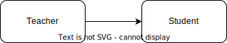
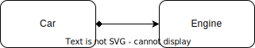

# Introduction to Object Relationships

When designing software, objects often interact with each other to perform specific tasks. The way objects interact and depend on each other can be characterized into different types of relationships. Understanding these relationships is essential for creating well-structured, maintainable code. Primarily we will explore the following object relationships:

- Dependency
- Association
- Aggregation
- Composition
  
## Dependency

Dependency is the simplest form of object relationship, where one class depends on another class to perform a specific task. In this relationship, a class uses another class's methods or objects within its scope. A dependency exists between two classes if changes to the definition of one class result in modifications to the other class.

Imagine a `Teacher` that has a `Salary`:


```cpp
#include <iostream>

class Salary {
public:
    Salary(double baseSalary) : baseSalary(baseSalary) {}

    double getBaseSalary() const {
        return baseSalary;
    }

private:
    double baseSalary;
};

class Teacher {
public:
    Teacher(const std::string& name, double baseSalary)
        : name(name), salary(baseSalary) {}

    void displayInfo() const {
        std::cout << "Teacher name: " << name << "\n";
        std::cout << "Base salary: " << salary.getBaseSalary() << "\n";
    }

private:
    std::string name;
    Salary salary;
};

int main() {
    Teacher teacher("John Doe", 50000);
    teacher.displayInfo();
    return 0;
}
```

## Association

Association is a relationship between two classes where one class has a reference or pointer to an object of another class. This relationship is bidirectional and can represent a one-to-one, one-to-many, or many-to-many relationship.

Imagine a simple class hierarchy for a school, where a `Teacher` can teach multiple `Student`s:



```cpp
#include <string>
#include <vector>

class Student {
public:
    Student(const std::string& name) : name(name) {}

private:
    std::string name;
};

class Teacher {
public:
    Teacher(const std::string& name) : name(name) {}

    void add_student(std::shared_ptr<Student> student) {
        students.push_back(student);
    }

private:
    std::string name;
    std::vector<std::shared_ptr<Student>> students;
};

int main() {
    Teacher teacher{ "Mr. Smith" };

    auto student1 = std::make_shared<Student>("Alice");
    auto student2 = std::make_shared<Student>("Bob");

    teacher.add_student(student1);
    teacher.add_student(student2);

    // ...
}
```

## Aggregation

Aggregation is a special form of association where a class represents a collection of other classes. In this relationship, one class (the "whole") contains objects of another class (the "part"), but the part can exist independently of the whole.

Consider a simple `Library` that manages `Book`s:


```cpp
#include <string>
#include <vector>

class Book {
public:
    Book(const std::string& title) : title(title) {}

private:
    std::string title;
};

class Library {
public:
    void add_book(const Book& book) {
        books.push_back(book);
    }

private:
    std::vector<Book> books;
};

int main() {
    Library library;
    Book book1{ "The Catcher in the Rye" };
    Book book2{ "To Kill a Mockingbird" };
    library.add_book(book1);
    library.add_book(book2);

    // ...
}
```

## Composition

Composition is another form of association, but with a strong ownership relationship. In this relationship, one class (the "whole") contains objects of another class (the "part"), and the part's lifetime is strictly managed by the whole. When the whole is destroyed, the parts are destroyed as well.

Imagine a simple class hierarchy with `Car` and `Engine`:



```cpp
#include <iostream>

class Engine {
public:
    Engine() {
        std::cout << "Engine created!" << std::endl;
    }
};

class Car {
public:
    Car() : engine() {
        std::cout << "Car created!" << std::endl;
    }

private:
    Engine engine;
};

int main() {
    Car car;
    return 0;
}
```

# Exercises

## Exercise 1
Identify the **dependency** relationship in the following code:

```cpp
class Car {
public:
    Car(double fuel) : fuel(fuel) {}
    
    void refuel(double amount) {
        fuel += amount;
    }

private:
    double fuel;
};

class GasStation {
public:
    void fill_up(Car& car, double amount) {
        car.refuel(amount);
    }
};

int main() {
    Car car(10);
    GasStation station;
    station.fill_up(car, 5.0);

    // ...
}
```

---

```
The GasStation class depends on the Car class to perform the fill_up function. 
```

## Exercise 2

