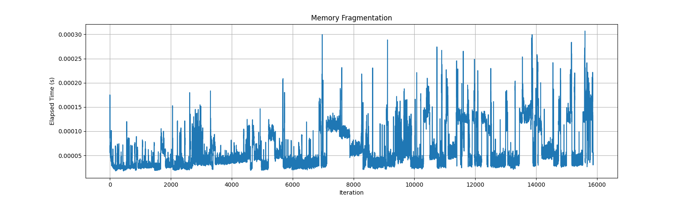
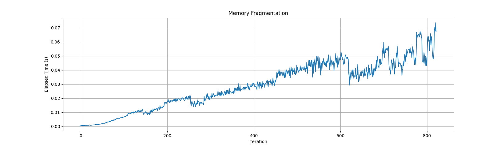

---
Learning Outcomes:
- Define and explain what an embedded system is
- Identify examples of embedded systems
- Explain key constraints in embedded systems
- Explain which C++ language features are best suited for these constraints
- Explain which C++ language features are worst suited for these constraints
- Test programs written with static vs dynamic memory allocation
- Test programs written with constexpr and consteval
- Test programs written with static vs automatic storage
- Test programs written with error codes vs exceptions
- Test programs written with std::array vs std::vector
---

# Introduction to Embedded Systems
## What are embedded systems?
Embedded systems are computer systems designed to perform specific tasks with dedicated hardware. They are typically part of a larger system or product and are designed to perform their tasks with minimal to no human intervention. Embedded systems often have limited resources, such as processing power, memory, and energy, which makes efficient programming crucial.

Examples of embedded systems include:

- Microcontrollers and microprocessors in various electronic devices
- Automotive systems (e.g., engine control units, anti-lock braking systems)
- Industrial control systems (e.g., programmable logic controllers, robotics)
- Medical devices (e.g., pacemakers, blood glucose monitors)
- Communication devices (e.g., routers, modems)

## Key constraints and challenges
Embedded systems often face unique constraints and challenges that set them apart from general-purpose computing.

Some of these constraints and challenges include:

- **Limited resources**: Embedded systems often have limited processing power, memory, and storage, which requires efficient and optimized code to run within these constraints.
  - The ATmega328P microcontroller, commonly used in Arduino Uno boards, has only 32 KB of flash memory, 2 KB of SRAM, and a 16 MHz clock speed.
- **Real-time requirements**: Many embedded systems need to meet strict timing requirements, which means they must deliver predictable performance and respond quickly to external events.
  - An automotive engine control unit (ECU) must be able to respond to sensor inputs and adjust fuel injection and ignition timing within microseconds to maintain optimal engine performance and meet emissions standards.
- **Power constraints**: Power consumption is often a critical concern for embedded systems, especially for battery-powered devices. This requires power-efficient hardware and software designs.
  - A wireless sensor node for environmental monitoring may have a small 1,000 mAh lithium-ion battery and a low-power microcontroller, like the STM32L0 series, with a current consumption of less than 100 μA in sleep mode. Developers must optimize power consumption in both hardware and software to maximize battery life.
- **Reliability and robustness**: Embedded systems must be reliable and robust, as they often operate in harsh environments and perform critical tasks. This requires careful design and extensive testing.
  - A satellite's onboard computer system must withstand extreme temperature variations (-120°C to +120°C), radiation, and vacuum conditions while reliably executing its mission-critical functions throughout the satellite's lifetime, which could be more than 15 years.
- **Longevity**: Embedded systems often need to run for extended periods without maintenance or upgrades. This requires stable and well-tested software that can handle potential failures gracefully.
  - A pipeline monitoring system in remote areas may have limited maintenance access and rely on solar panels for power. The system may use a low-power microcontroller with 256 KB of flash memory and 64 KB of SRAM and be designed to run for years without requiring firmware updates or maintenance.
- **Hardware-software co-design**: In many cases, the software and hardware of an embedded system are designed together to meet specific requirements. This requires close collaboration between hardware and software engineers.
  
Understanding these constraints and challenges is essential when developing embedded systems, as they directly impact the design, implementation, and testing of the software running on these systems.

List three examples of everyday embedded systems.

```
```

***

In what ways are each of these three embedded systems constrained?

```
```

***

# Basics of Embedded C++
## C++ features and considerations for embedded systems
C++ offers several features that can help you write efficient and maintainable embedded code. However, some features may not be suitable for all embedded systems due to resource constraints. Here are some key considerations for using C++ in embedded systems:

### **Static vs dynamic memory allocation**
In embedded systems, it is often preferable to use static memory allocation instead of dynamic memory allocation, where possible. Dynamic memory allocation (using `new` and `delete` or `malloc` and `free`) can lead to memory fragmentation and unpredictable behavior, which can be problematic in resource-constrained environments. Prefer using C++ containers like `std::array` over `std::vector` when possible, unless you are using custom memory allocators that replace dynamic memory allocation.

To illustrate the potential harm of dynamic memory allocation, let's take a look at the following code, which allocates `num_allocations` random amounts of memory on the heap using `malloc`, then deallocates half of it at random using `free`. The time it takes to perform these `num_allocations` is recorded using `steady_clock`, a time utility from the standard library. Each recorded time, along with the current iteration is written to a csv file, which can then be plotted.

```cpp
#include <chrono>
#include <cstdlib>
#include <iostream>
#include <fstream>
#include <vector>

constexpr size_t num_iterations = 1'000'000;
constexpr size_t num_allocations = 500;
constexpr size_t min_allocation_size = 16;
constexpr size_t max_allocation_size = 4096;

size_t random_allocation_size() {
    return min_allocation_size + rand() % (max_allocation_size - min_allocation_size + 1);
}

void allocate(auto& container) {
    for (size_t i = 0; i < num_allocations; ++i) {
        size_t size = random_allocation_size();
        void* block = malloc(size);
        container.push_back(block);
    }
}

void deallocate(auto& container) {
    for (size_t i = 0; i < num_allocations / 2; ++i) {
        size_t index = rand() % container.size();
        free(container[index]);
        container.erase(container.begin() + index);
    }
}

auto time(auto function) {
    auto start = std::chrono::steady_clock::now();
    function();
    auto end = std::chrono::steady_clock::now();
    std::chrono::duration<double> elapsed_seconds = end - start;
    return elapsed_seconds;
}

void write_to_csv(auto& file, auto iteration, auto elapsed_seconds) {
    file << iteration << "," << elapsed_seconds << std::endl;
}

int main() {
    std::vector<void*> allocated_blocks;
    allocated_blocks.reserve(num_iterations * num_allocations);

    std::ofstream output_file("memory_fragmentation.csv");

    output_file << "Iteration,ElapsedTime(s)" << std::endl;

    for (size_t iteration = 0; iteration < num_iterations; ++iteration) {
        auto elapsed_seconds = time([&allocated_blocks](){ allocate(allocated_blocks); });
        write_to_csv(output_file, iteration, elapsed_seconds.count());
        deallocate(allocated_blocks);
    }

    return 0;
}
```

Running the above code with `max_allocation_size = 4096` for roughly 16,000 iterations, we get the following figure:



Taking a look at this first figure, we can see that up until roughly iteration 1800, the time it took to allocate memory on the heap was fairly consistent, with `num_allocations` allocations taking roughly 0.000025 seconds with occasional spikes up around 0.000075. If we then take a look at the figure around 15000 iterations, we can see that our best-case time has increased to closer to 0.00003 or 0.00004 seconds, the time it took to allocate memory became very inconsistent and varied significantly between allocations, and we were frequently experiencing 5x to 10x slowdowns.

Running the above code with `max_allocation_size = 4096*4096` for roughly 825 iterations, we get the following figure:



Taking a look at this second figure, we can see a clear and steady increase in the amount of time it takes for dynamic memory allocations, and this time becomes increasingly more varied and less consistent.

If our system had strict real-time requirements, we can see how memory fragmentation as a result of dynamic memory allocation presents a significant problem. Additionally, imagine that this code was running on a device that was either prohibitively difficult or impossible to service. Eventually, the performance would degrade to a point where the device may not be able to carry out its task at all.

### **C++ standard library**
The C++ standard library provides many useful features and containers, but some parts of it may not be suitable for embedded systems due to their memory and performance overhead. Be selective about which parts of the standard library you use and consider alternative, more lightweight libraries specifically designed for embedded systems.

In general, the following language features can and should be used:

- Enum classes
- Classes
- Inheritance
- Templates
- Function overloading and default parameters
- Operator overloading
- References
- Namespaces
- Smart pointers (`std::unique_ptr`, `std::shared_ptr`)
- Virtual methods
- `using`
- `auto`
- `std::array`
- `constexpr`
- `consteval`

And the following language features could be used, but only after careful consideration, and depending on the platform:
- `new`/`delete`
- RTTI
- Exceptions
- `std::string`
- `std::vector`
- Template metaprogramming

For each of the language features above, provide one or more reasons why they are recommended or not recommended for use in an embedded context. Research if you need to.

```
```

***

```
- Enum classes: Provide better type safety and scoping compared to plain enums, which helps prevent bugs and improves code readability.

- Classes: Encapsulate data and behavior, promoting modularity, code reuse, and maintainability.

- Inheritance: Enables code reuse and abstraction, simplifying complex systems.

- Templates: Enable compile-time polymorphism and code reuse, reducing code duplication and runtime overhead.

- Function overloading and default parameters: Improves code readability and flexibility by allowing multiple implementations of a function based on argument types or providing default values for arguments.

- Operator overloading: Allows custom implementations of operators for user-defined types, improving code readability and consistency.

- References: Provide safer and more predictable behavior compared to pointers, reducing the risk of null pointer dereferences and other memory-related bugs.

- Namespaces: Prevent naming conflicts and organize code, improving modularity and maintainability.

- Smart pointers (e.g., std::unique_ptr, std::shared_ptr): Automatically manage memory allocation and deallocation, reducing the risk of memory leaks and making code more robust.

- using: Allows for type aliasing and simplifies code, improving readability.

- auto: Enables automatic type deduction, making code more concise and less error-prone.

- std::array: Provides a fixed-size, stack-allocated container, ensuring predictable memory usage and performance.

- constexpr: Enables compile-time constant expression evaluation, reducing runtime overhead and improving performance.

- consteval: Enforces compile-time evaluation of a function, ensuring no runtime overhead.

- new/delete: Can lead to memory leaks and fragmentation, which is problematic in memory-constrained environments. Prefer using smart pointers or stack-based allocation.

- Virtual methods: Introduce runtime overhead due to vtable lookups and can increase code size. Consider alternatives such as static polymorphism with templates.

- RTTI (Run-Time Type Information): Increases code size and introduces runtime overhead, which can be problematic in resource-constrained systems.

- Exceptions: Can introduce significant code size overhead, unpredictable performance, and stack unwinding issues. Prefer error codes or other error handling mechanisms in critical systems.

- std::string: Uses dynamic memory allocation and can cause memory fragmentation. Consider using fixed-size character arrays or custom string types optimized for embedded systems.

- std::vector: Uses dynamic memory allocation and can cause memory fragmentation. Prefer fixed-size containers like std::array or custom containers optimized for embedded systems.

- Template metaprogramming: Can lead to code bloat and increased compilation times. Use with caution and measure its impact on code size and performance.
```

# Exercises
## Exercise 1
There are several popular libraries aimed at providing utilities and containers for embedded C++ programs. These libraries may offer alternatives to standard template library containers such as `std::vector` that are safer to use in an embedded context, usually due to their avoidance of dynamic memory allocation, memory allocators and memory pools that make use of static memory and again avoid dynamic memory allocation, etc. Do some research and provide links to a couple of libraries that appear useful.

```
```

***

```
- https://github.com/ETLCPP/etl
- https://github.com/foonathan/memory
```

## Exercise 2
Create an enum class representing the different states of a traffic light (red, yellow, and green). Write a function that takes a traffic light state as an argument and returns the duration of that state in seconds.

```
```

***

```cpp
#include <iostream>

enum class TrafficLightState { Red, Yellow, Green };

int stateDuration(TrafficLightState state) {
    switch (state) {
        case TrafficLightState::Red:
            return 30;
        case TrafficLightState::Yellow:
            return 5;
        case TrafficLightState::Green:
            return 25;
        default:
            return 0;
    }
}

int main() {
    std::cout << "Red light duration: " << stateDuration(TrafficLightState::Red) << " seconds" << std::endl;
}
```

## Exercise 3
Create an abstract class called Sensor with a pure virtual function read() that returns a float. Derive two classes from Sensor: TemperatureSensor and PressureSensor. Implement the read() function for each derived class, simulating reading temperature and pressure values.

```
```

***

```cpp
#include <iostream>

class Sensor {
public:
    virtual float read() = 0;
};

class TemperatureSensor : public Sensor {
public:
    float read() override {
        return 25.0f;  // Simulate reading temperature
    }
};

class PressureSensor : public Sensor {
public:
    float read() override {
        return 1013.25f;  // Simulate reading pressure
    }
};

int main() {
    TemperatureSensor tempSensor;
    PressureSensor pressureSensor;
    std::cout << "Temperature: " << tempSensor.read() << " °C" << std::endl;
    std::cout << "Pressure: " << pressureSensor.read() << " hPa" << std::endl;
}
```

## Exercise 4
Implement a templated function clamp that takes a minimum value, a maximum value, and a value to clamp. If the value is less than the minimum, return the minimum. If the value is greater than the maximum, return the maximum. Otherwise, return the value. Test the function with different types like int, float, and double.

```
```

***

```cpp
#include <iostream>

template <typename T>
T clamp(const T& value, const T& min, const T& max) {
    if (value < min) {
        return min;
    } else if (value > max) {
        return max;
    }
    return value;
}

int main() {
    std::cout << clamp(5, 10, 20) << std::endl;
    std::cout << clamp(15.0f, 10.0f, 20.0f) << std::endl;
    std::cout << clamp(25.0, 10.0, 20.0) << std::endl;
}
```

## Exercise 5
Create a class DataProcessor that takes a pointer to a Sensor as its constructor argument. Implement a method processData() in DataProcessor that reads data from the sensor, processes it (e.g., by multiplying it by a constant), and returns the result. Use a smart pointer (std::unique_ptr) to manage the lifetime of the Sensor objects.

```
```

***

```cpp
#include <iostream>
#include <memory>

class Sensor {
public:
    virtual float read() = 0;
    virtual ~Sensor() = default;
};

class TemperatureSensor : public Sensor {
public:
    float read() override {
        return 25.0f;  // Simulate reading temperature
    }
};

class DataProcessor {
public:
    explicit DataProcessor(std::unique_ptr<Sensor> sensor) : sensor(std::move(sensor)) {}

    float processData() {
        float data = sensor->read();
        return data * 1.5f;
    }

private:
    std::unique_ptr<Sensor> sensor;
};

int main() {
    std::unique_ptr<Sensor> tempSensor = std::make_unique<TemperatureSensor>();
    DataProcessor processor(std::move(tempSensor));
    std::cout << "Processed data: " << processor.processData() << std::endl;
}
```

## Exercise 6
Write a constant representing the number pi using constexpr. Then write a consteval function that computes the circumference of a circle of a given radius that uses this pi constant. Use a tool like [godbolt.org]() to observe what the compiled code looks like.

```
```

***

```cpp
#include <iostream>

constexpr double PI = 3.141592653589793;

consteval double calculateCircumference(double radius) {
    return 2.0 * PI * radius;
}

int main() {
    double circumference1 = calculateCircumference(3.5);
    std::cout << circumference1 << "\n";
    double circumference2 = calculateCircumference(12.23);
    std::cout << circumference2 << "\n";
}
```