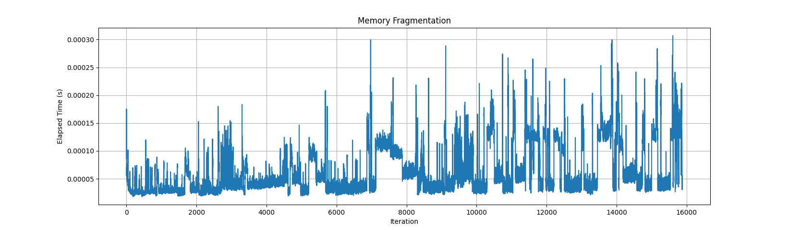

---
学習の成果目標:
- 組み込みシステムとは何かを定義し説明する
- 組み込みシステムの例を確認する
- 組み込みシステムの主な制約について説明する
- これらの制約に最適なC++言語の機能がどれか説明する
- これらの制約に最も適していないC++言語の機能がどれか説明する
- 静的メモリ割り当てと動的メモリ割り当てを使用して、記述されたプログラムをテストする
- constexprとconstevalを使用して記述されたプログラムをテストする
- 静的ストレージと自動ストレージで記述されたプログラムをテストする
- エラーコードと例外を使用して記述されたプログラムをテストする
- std::arrayとstd::vectorを使用して記述されたプログラムをテストする
---

# 組み込みシステムの紹介
## 組み込みシステムとは
組み込みシステムは、専用ハードウェアで特定のタスクを実行するように設計された、コンピュータシステムです。通常、大規模システムまたは製品の一部であり、人間の介入を最小限に抑えたものから、まったく介入しないものまであり、それに応じてタスクを実行するように設計されています。多くの場合、組み込みシステムは処理能力、メモリ、電力などのリソースが限られているため、効率的なプログラミングが重要になります。

組み込みシステムの例としては、次のものがあります。

- 各種電子機器のマイクロコントローラーおよびマイクロプロセッサ
- 自動車システム(例: エンジン制御ユニット、アンチロックブレーキシステム)
- 産業用制御システム(例: プログラマブルロジックコントローラー、ロボティクス)
- 医療機器(ペースメーカー、血糖モニターなど)
- 通信デバイス(ルーター、モデムなど)

## 主な制約と課題
組み込みシステムは、汎用演算システムとは異なる独自の制約や課題によく直面します。

これらの制約と課題には次のようなものがあります。

- **リソースの制限**: 多くの場合、組み込みシステムの処理能力、メモリ、ストレージは限られているため、これらの制約内で実行するには、効率的で最適化されたコードが必要です。
  - Arduino Unoボードで一般的に使用されているATmega328Pマイクロコントローラーには、32 KBのフラッシュメモリ、2 KBのSRAM、クロック速度は16 MHzしかありません。
- **リアルタイム要件**: 多くの組み込みシステムは、厳しいタイミング要件を満たす必要があります。つまり、予測可能なパフォーマンスを提供し、外部イベントに速やかに応答しなければなりません。
  - 自動車のエンジン制御ユニット(ECU)は、センサー入力に応答し、燃料噴射と点火タイミングを数マイクロ秒以内に調整して、最適なエンジン性能を維持し、排出基準を満たすことができなければなりません。
- **電力の制約**: 組み込みシステム、特にバッテリー駆動のデバイスでは、消費電力が重要な問題になることがよくあります。これを解決するには、電力効率の高いハードウェアとソフトウェアを設計する必要があります。
  - 環境モニタリング用のワイヤレスセンサーノードには、1,000 mAhの小型リチウムイオンバッテリーと、STM32L0シリーズのような低電力マイクロコントローラーがあり、スリープモードでの消費電流は100 μA未満です。開発者は、バッテリー寿命を最大化するために、ハードウェアとソフトウェアの両方で電力消費を最適化する必要があります。
- **信頼性と堅牢性**: 組み込みシステムは、過酷な環境で動作し、重要なタスクを実行することが多いため、信頼性と堅牢性が不可欠であり、慎重な設計と広範なテストが求められます。
  - 衛星に搭載されたコンピュータシステムは、極端な温度変化(-120 °C～+120 °C)、放射線、真空条件に耐えながら、衛星の寿命(15年以上)にわたってミッションクリティカルな機能を確実に実行しなければなりません。
- **長寿命**: 多くの場合、組み込みシステムは、メンテナンスやアップグレードなしで長期間の稼働に耐えうるものでなければなりません。これには、潜在的な障害を適切に処理できる、安定し、かつ十分にテストされたソフトウェアが必要です。
  - 遠隔地のパイプライン監視システムは、現地でのメンテナンスが難しく、電力を太陽光パネルに依存している場合があります。システムには256 KBのフラッシュメモリと64 KBのSRAMを備えた低電力マイクロコントローラーを使用し、ファームウェアの更新やメンテナンスがなくても何年も動作するように設計されています。
- **ハードウェアとソフトウェアの協調設計**: 多くの場合、組み込みシステムのソフトウェアとハードウェアは、特定の要件を満たすように一緒に設計されています。これには、ハードウェアエンジニアとソフトウェアエンジニアの緊密な協力が必要です。
  
これらの制約と課題を理解することは、組み込みシステムを開発する際に不可欠です。これらのシステムで実行されるソフトウェアの設計、実装、テストに直接影響するからです。

日常で使用する組み込みシステムの例を3つ挙げてください。

---

これら3つの組み込みシステムには、それぞれどのような制約があるでしょうか。

---

# 組み込みC++の基礎
## 組み込みシステムのC++の機能と考慮すべき事項
C++には、効率的で保守しやすい組み込みコードの作成に便利な機能がいくつか用意されています。ただし、リソースの制約により、すべての組み込みシステムに適していない機能もあります。組み込みシステムでC++を使用する場合に考慮すべき重要事項を次に示します。

### **静的メモリ割り当てと動的メモリ割り当て**
組み込みシステムでは、可能であれば、動的メモリ割り当てではなく静的メモリ割り当てを使用することが望ましい場合がよくあります。(`new`と`delete`または`malloc`と`free`を使用した)動的メモリ割り当ては、メモリの断片化と予測不能な動作につながる可能性があり、リソースに制約のある環境では問題となる可能性があります。できれば、[std::allocator](https://en.cppreference.com/w/cpp/memory/allocator)または[std::pmr::](https://en.cppreference.com/w/cpp/memory/polymorphic_allocator)からカスタムメモリアロケーターを備えた`std::vector`などのC++コンテナを使用することをお勧めします。それ以外の場合は、Cスタイルの配列を使用するのではなく、`std::array`など、メモリを動的に割り当てないコンテナを使用します。

動的メモリ割り当てによって起こりうる弊害を説明するために、次のコードを見てみましょう。このコードでは、`malloc`で`num_allocations`のランダムな量のメモリをヒープに割り当て、`free`でその半分をランダムに割り当て解除します。これらの`num_allocations`の実行にかかる時間は、標準ライブラリの時間ユーティリティである`steady_clock`を使用して記録されます。記録された各時間は、現在のイテレーションと共にcsvファイルに書き込まれ、描画できます。

```cpp
#include <chrono>
#include <cstdlib>
#include <iostream>
#include <fstream>
#include <vector>

constexpr size_t num_iterations = 1'000'000;
constexpr size_t num_allocations = 500;
constexpr size_t min_allocation_size = 16;
constexpr size_t max_allocation_size = 4096;

size_t random_allocation_size() {
    return min_allocation_size + rand() % (max_allocation_size - min_allocation_size + 1);
}

void allocate(auto& container) {
    for (size_t i = 0; i < num_allocations; ++i) {
        size_t size = random_allocation_size();
        void* block = malloc(size);
        container.push_back(block);
    }
}

void deallocate(auto& container) {
    for (size_t i = 0; i < num_allocations / 2; ++i) {
        size_t index = rand() % container.size();
        free(container[index]);
        container.erase(container.begin() + index);
    }
}

auto time(auto function) {
    auto start = std::chrono::steady_clock::now();
    function();
    auto end = std::chrono::steady_clock::now();
    std::chrono::duration<double> elapsed_seconds = end - start;
    return elapsed_seconds;
}

void write_to_csv(auto& file, auto iteration, auto elapsed_seconds) {
    file << iteration << "," << elapsed_seconds << std::endl;
}

int main() {
    std::vector<void*> allocated_blocks;
    allocated_blocks.reserve(num_iterations * num_allocations);

    std::ofstream output_file("memory_fragmentation.csv");

    output_file << "Iteration,ElapsedTime(s)" << std::endl;

    for (size_t iteration = 0; iteration < num_iterations; ++iteration) {
        auto elapsed_seconds = time([&allocated_blocks](){ allocate(allocated_blocks); });
        write_to_csv(output_file, iteration, elapsed_seconds.count());
        deallocate(allocated_blocks);
    }

    return 0;
}
```

上記のコードを`max_allocation_size = 4096`で約16,000回実行すると、次の図が得られます。



この最初のグラフを見ると、1800回目くらいのイテレーションまで、ヒープにメモリを割り当てるのにかかった時間はおおむね一定であり、`num_allocations`を使用した割り当てには約0.000025秒かかり、0.000075秒あたりまで急上昇する場合もあることがわかります。次に、約15000回目のイテレーションの数値を見ると、ベストケースでかかった時間が0.00003または0.00004秒近くまで増加し、メモリの割り当てにかかった時間が非常に不安定になり、割り当て間の振れ幅が非常に大きくなったことがわかります。速度が1/5〜1/10になることも頻繁に発生しました。

上記のコードを`max_allocation_size = 4096*4096`で約825回実行すると、次の図が得られます。


この2番目のグラフを見ると、動的メモリ割り当てにかかる時間が確実に増加していることがわかります。この時間の振れ幅はどんどん大きくなり、不安定になっています。

システムに厳密なリアルタイム要件がある場合、動的メモリ割り当ての結果、メモリの断片化が重大な問題を引き起こすことがわかります。また、このコードが、保守が非常に困難または不可能なデバイスで実行されていると考えてみてください。最終的にはパフォーマンスが低下し、デバイスがタスクをまったく実行できなくなる可能性があります。

### **C++標準ライブラリ**
C++標準ライブラリは、多くの便利な機能とコンテナを提供しますが、その一部は、メモリとパフォーマンスのオーバーヘッドが原因で、組み込みシステムではうまく使用できない場合があります。標準ライブラリのどの部分を使用するかを選択し、組み込みシステム専用に設計された、より軽量な代替ライブラリを検討してください。

一般に、C++では次の機能が使用できます。
  
- [enumクラス](https://en.cppreference.com/w/cpp/language/enum)(C++11)
- クラス
- 継承
- テンプレート
- 関数のオーバーロードとデフォルトパラメータ
- 演算子のオーバーロード
- 参照
- 名前空間
- 仮想メソッド
- [`std::unique_ptr`](https://en.cppreference.com/w/cpp/memory/unique_ptr) (C++11)
- [`using`](https://en.cppreference.com/w/cpp/language/type_alias) (C++11)
- [`auto`](https://en.cppreference.com/w/cpp/language/auto) (C++11, C++17)
- [`std::array`](https://en.cppreference.com/w/cpp/container/array) (C++11)
- [`std::string_view`](https://en.cppreference.com/w/cpp/string/basic_string_view) (C++17)
- [`constexpr`](https://en.cppreference.com/w/cpp/language/constexpr) (C++11)
- [`consteval`](https://en.cppreference.com/w/cpp/language/consteval) (C++20)
- [`if constexpr`](https://en.cppreference.com/w/cpp/language/if) (C++17)
- [`if consteval`](https://en.cppreference.com/w/cpp/language/if) (C++23)
- [`noexcept指定子`](https://en.cppreference.com/w/cpp/language/noexcept_spec)(C++11)
- [`noexcept演算子`](https://en.cppreference.com/w/cpp/language/noexcept)(C++11)
- [`static_assert`](https://en.cppreference.com/w/cpp/language/static_assert)(C++11、C++17)
- [例外](https://en.cppreference.com/w/cpp/language/exceptions)
- [関数オブジェクト](https://en.cppreference.com/w/cpp/utility/functional)
- [Unit型](https://en.cppreference.com/w/cpp/language/type_alias)、例[std::chrono::duration](https://en.cppreference.com/w/cpp/chrono/duration)(C++11)

また、次の機能を使用できますが、プラットフォームによっては、使用には慎重な検討を要する場合もあります。

- [`new`](https://en.cppreference.com/w/cpp/language/new)/[`delete`](https://en.cppreference.com/w/cpp/language/delete)
- [`std::shared_ptr`](https://en.cppreference.com/w/cpp/memory/shared_ptr) (C++11)
- [RTTI](https://en.cppreference.com/w/cpp/language/typeid)
- [`std::string`](https://en.cppreference.com/w/cpp/string/basic_string)
- [`std::vector`](https://en.cppreference.com/w/cpp/container/vector)
- [`std::function`](https://en.cppreference.com/w/cpp/utility/functional/function)
- 型消去

# 演習
## 演習1
組み込みC++プログラム用のユーティリティとコンテナの提供を目的とした、評価の高いライブラリがいくつかあります。これらのライブラリは、組み込みコンテキストで使用する方が安全な、`std::vector`などの標準テンプレートライブラリコンテナに代わる機能を提供します。多くの場合、これらを使用すると動的メモリ割り当て、メモリアロケーター、静的メモリを使用するメモリプールを回避でき、動的メモリ割り当てを再度回避できるためです。いくつか試してみて、役に立ちそうなライブラリへのリンクを紹介してください。

---

```
- https://github.com/ETLCPP/etl
- https://github.com/foonathan/memory
```

## 演習2
信号機の状態(赤、黄、青)を表すenumクラスを作成します。信号機の状態を引数として、その状態の継続時間を秒単位で返す関数を作成してください。

---

```cpp
#include <iostream>

enum class TrafficLightState { Red, Yellow, Green };

int stateDuration(TrafficLightState state) {
    switch (state) {
        case TrafficLightState::Red:
            return 30;
        case TrafficLightState::Yellow:
            return 5;
        case TrafficLightState::Green:
            return 25;
        default:
            return 0;
    }
}

int main() {
    std::cout << "Red light duration: " << stateDuration(TrafficLightState::Red) << " seconds" << std::endl;
}
```

## 演習3
`TemperatureSensor`と`PressureSensor`という2つの抽象クラスを作成します。それぞれに、`temperature::kelvin`と`pressure::psi`を返す純粋仮想関数read()があります。適切な基底型から`CPUTemperature`、`CabinTemperature`、`TirePressure`を派生させます。派生クラスごとに`read()`関数を実装し、温度と圧力値の読み取りをシミュレートします。`double`や`float`をそのまま使うのではなく、Unit型を使用すると加点されます。

---

```cpp
#include <iostream>

namespace temperature {
    struct kelvin {
        double value;
        explicit kelvin(double v) : value(v) {}
    };
}

namespace pressure {
    struct psi {
        double value;
        explicit psi(double v) : value(v) {}
    };
}

class TemperatureSensor {
public:
    virtual temperature::kelvin read() const = 0;
};

class PressureSensor {
public:
    virtual pressure::psi read() const = 0;
};

class CPUTemperature : public TemperatureSensor {
public:
    temperature::kelvin read() const override {
        return temperature::kelvin{310.0};
    }
};

class CabinTemperature : public TemperatureSensor {
public:
    temperature::kelvin read() const override {
        return temperature::kelvin{295.0};
    }
};

class TirePressure : public PressureSensor {
public:
    pressure::psi read() const override {
        return pressure::psi{32.0};
    }
};

int main() {
    CPUTemperature cpu_temp_sensor;
    CabinTemperature cabin_temp_sensor;
    TirePressure tire_pressure_sensor;

    temperature::kelvin cpu_temp = cpu_temp_sensor.read();
    temperature::kelvin cabin_temp = cabin_temp_sensor.read();
    pressure::psi tire_pressure = tire_pressure_sensor.read();

    std::cout << "CPU Temperature: " << cpu_temp.value << " K" << std::endl;
    std::cout << "Cabin Temperature: " << cabin_temp.value << " K" << std::endl;
    std::cout << "Tire Pressure: " << tire_pressure.value << " psi" << std::endl;

    return 0;
}
```

## 演習4
最小値、最大値、クランプする値を取得する、テンプレート関数clampを実装してください。値が最小値より小さい場合は、最小値を返します。値が最大値より大きい場合は、最大値を返します。それ以外の場合は、値を返します。int、float、doubleなどのさまざまな型で関数をテストしてください。

---

```cpp
#include <iostream>

template <typename T>
T clamp(const T& value, const T& min, const T& max) {
    if (value < min) {
        return min;
    } else if (value > max) {
        return max;
    }
    return value;
}

int main() {
    std::cout << clamp(5, 10, 20) << std::endl;
    std::cout << clamp(15.0f, 10.0f, 20.0f) << std::endl;
    std::cout << clamp(25.0, 10.0, 20.0) << std::endl;
}
```

## 演習5
Sensorへのポインタをコンストラクタの引数として取得するDataProcessorクラスを作成してください。センサーからデータを読み取り、それを処理して(定数を乗算するなど)、結果を返すDataProcessorにprocessData()メソッドを実装してください。Sensorオブジェクトの寿命を管理するには、スマートポインタ(std::unique_ptr)を使用します。

---

```cpp
#include <iostream>
#include <memory>

class Sensor {
public:
    virtual float read() = 0;
    virtual ~Sensor() = default;
};

class TemperatureSensor : public Sensor {
public:
    float read() override {
        return 25.0f;
    }
};

class DataProcessor {
public:
    explicit DataProcessor(std::unique_ptr<Sensor> sensor) : sensor(std::move(sensor)) {}

    float processData() {
        float data = sensor->read();
        return data * 1.5f;
    }

private:
    std::unique_ptr<Sensor> sensor;
};

int main() {
    std::unique_ptr<Sensor> tempSensor = std::make_unique<TemperatureSensor>();
    DataProcessor processor(std::move(tempSensor));
    std::cout << "Processed data: " << processor.processData() << std::endl;
}
```

## 演習6
constexprを使用して、数値piを表す定数を記述してください。次に、この定数piを使用して、与えられた円の半径の円周を計算するconsteval関数を作成してください。[godbolt.org]()などのツールを使用して、コンパイルされたコードがどのように表示されるか見てみましょう。

---

```cpp
#include <iostream>

constexpr double PI = 3.141592653589793;

consteval double calculateCircumference(double radius) {
    return 2.0 * PI * radius;
}

int main() {
    double circumference1 = calculateCircumference(3.5);
    std::cout << circumference1 << "\n";
    double circumference2 = calculateCircumference(12.23);
    std::cout << circumference2 << "\n";
}
```